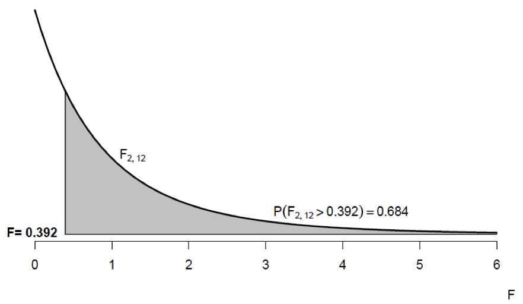

```{r setup, include=FALSE}
knitr::opts_chunk$set(echo = TRUE)

if ( ! require('haven'))
  install.packages('haven')
if ( ! require('car'))
  install.packages('car')

loadNamespace('haven')
loadNamespace('car')
```

```{block include=(!params$inc_solu)}
<style>
.section.level5 {
  display: none ;
}
</style>
```

# Lab 3 - Week 4

#### Recall Lecture 2

  - Revision
    - Type I and II Errors
    - Statistical Power for Tests
  - One-way ANOVA

### Lab Objectives

#### On completion of this lab you will be able to:

 - describe the general relationships between power and each of significance level, sample size, effect size, error deviation.
 - perform a power calculation for a two sample t-test
 - perform a power calculation for a one-way ANOVA
 - perform a one-way ANOVA

#### Overview

In the Week 2 lecture (and in Module 2) we described how the sampling distribution of the test statistic shifts location (i.e., has a different centre) when there really is a difference in population means (i.e., when Null hypothesis is false) and how the larger the shift the larger the power of the hypothesis test (to detect such a shift), i.e., the larger the effect size the larger the power to detect such a difference.

We also explored how the power of a test is affected by sample size and did some preliminary power calculations for the Yoghurt data set presented in Lab 1.

We will now perform some further calculations for power and sample size.

#### Data Files

```{r echo=FALSE}
# a single file
xfun::embed_file("Lab 03 - Fertilizer.sav")

# multiple files
#xfun::embed_files(c('source.Rmd', 'data.csv'))

# a directory
#xfun::embed_dir('data/', text = 'Download full data')
```

## 3.1 One-way Fixed Effects ANOVA

In an effort to determine whether there was any difference between three types of fertiliser, agricultural researchers subdivided a 30 hectare farm into plots of two hectares each. Of these 15 plots, five were treated with fertiliser A, five were treated with fertiliser B, and five were treated with fertiliser C. Wheat was planted on the farm and, at the end of the season, the number of tonnes reaped from each plot was measured. The data for this experiment are in the data file *Lab 02 - Fertilizer.sav* and displayed in the following table.

  | Plot |  A  |  B  |  C  |
  |------|-----|-----|-----|
  |   1  | 2.8 | 3.4 | 3.1 |
  |   2  | 2.6 | 2.9 | 2.5 |
  |   3  | 3.1 | 2.5 | 2.7 |
  |   4  | 2.7 | 3.1 | 2.9 |
  |   5  | 3.5 | 2.9 | 2.8 |

Is there a difference in the mean wheat yield for the three types of fertilisers?

We can analyse this data using the one-way ANOVA model for a single fixed effect as described in lecture:

$$ Y_{ij} = µ_{i} + ε_{ij} $$
$$ Y = µ + α_{i} + ε_{ij} $$

#### 1. Define clearly all the model's symbols (including defining the subscripts) in the context of this example.

#####

The symbols of the oneway ANOVA model may be defined as follows:

 - $Y$ represents the response variable; in this case the tonnes of wheat reaped per two hectare plot.
 - $i$ = 1, 2 or 3 indicates the different values of the nominal explanatory variable. In this example there are 3 different types of fertiliser and $i$ differentiates them. Let's say A corresponds to $i$ = 1, B to $i$ = 2 and C to $i$ = 3.
 - $j$ = 1, . . . , 5 differentiates between observations in each group, corresponding to different plots treated with each fertiliser type. This is a balanced design as there are the same numbers of plots treated with each fertiliser type.
 - $µ_i$ is the population mean tonnes of wheat reaped per two hectare plot for plots treated with fertiliser $i$.
 - $µ$ is the overall population mean tonnes of wheat reaped per two hectare plot, i.e., the average across all 3 fertiliser types. 
 - $α_i$ is the effect of fertiliser $i$ on the population mean tonnes of wheat reaped per two hectare plot, i.e. the difference between $µ_i$ and $µ$.
 - $ε_{ij}$ is the error term for the $j$th plot treated with fertiliser $i$. Assumed to be $N(0, σ^2$). In other words, this is the remaining, unexplained variation for observation $Y_{ij}$ after allowing for the effect of the fertiliser type.

#### 2. Write the appropriate null and alternative hypotheses for the given research question.

##### Solutions

The null hypothesis and alternative hypothesis for testing the equality of multiple population means is (once we have defined as above)

  $$ H_0: α_i = 0\ \ for\ all\ i $$
  $$ H_a: α_i ≠ 0\ \ for\ at\ least\ one\ i $$

or, equivalently:

$H_0$: Fertiliser type A, B, or C has NO effect on the population mean tonnage of wheat reaped per two ha plot.

$H_a$: Fertiliser type does affect the population mean tonnage of reaped per two 	 	hectare plot.

#### 3. Perform a one way fixed effects ANOVA and reproduce the ANOVA table below.

```{r echo=FALSE}
data <- haven::read_sav('Lab 03 - Fertilizer.sav')
data <- as.data.frame(data)
jmv::ANOVA(formula=Tonnes ~ Type, data)$main
```


construct a model using the `lm()` function, and then pass this model to the `anova()` function.


Analyses → ANOVA → ANOVA.

##### Solutions

Ⓢ 

```{r}
model <- lm(Tonnes ~ Type, data)

anova(model)
```

#### 4. Label each component of the ANOVA table. Indicate how the df, SS components, MS components, and F test statistic were calculated.

  |                |  SS   | df |  MS   |   F  |  p   |
  |----------------|-------|----|-------|------|------|
  |||||||
  | Between Groups | 0.076 |  2 | 0.038 | .392 | .684 |
  | Within Groups  | 1.164 | 12 | 0.097 |
  | Total          | 1.240 | 14 |

##### Solutions

Ⓢ 

  |                |  SS   | df |  MS   |   F  |  p   |
  |----------------|-------|----|-------|------|------|
  |||||||
  | Between Groups | 0.076 | (Groups - 1) | (SS / df) | $F_{between} / F_{within}$ | .684 |
  | Within Groups  | 1.164 | (N - Groups) | (SS / df) |
  | Total          | 1.240 | (N - 1)   |

  

#### 5. Draw a diagram showing the value of the test statistic for this test and the associated p-value.

##### Solutions

Ⓢ 



#### 6. Recall from STAT1070 the use of post-hoc testing. Is it appropriate to carry out post-hoc tests to compare group means in this scenario? If so, what test is most appropriate to identify which fertilisers differ in terms of the tonnes reaped and conduct the test?  If not appropriate, why not?

##### Solutions

Ⓢ 

No. Post-hoc tests are inappropriate as the result of the ANOVA test was NOT statistically significant. i.e there is no treatment effect so it is not appropriate to determine between which treatments there is a significant difference.

#### 7. Although we should firstly test whether model assumptions hold, provide a concluding statement that would be appropriate to include in a report summarising the results of this research (assuming the assumptions hold).

##### Solutions

Ⓢ 

The fertiliser type used has no statistically significant effect on the population mean tonnes of wheat reaped (p = 0.684).

OR

There is no statistically significant difference in the population mean tonnes of wheat reaped for plots treated with fertiliser type A, B or C (p = 0.684).

#### 8. What assumptions have you made in this analysis?

NOTE: we intentionally focus on the conceptual understanding and then mechanics first since a focus on the assumptions is usually less appealing for students (so may lose interest) and are better understood after getting involved with the data and technique. HOWEVER, assumptions should be tested early!

##### Solutions

Ⓢ 

The assumptions are:

 - Each of the three samples of 5 wheat yields for the fertiliser types A, B, and C can be considered a random sample from the population of possible wheat yields for plots treated with that particular fertiliser type and is independent of (unrelated to) any of the other samples.
 - The population wheat yield measurements for each of the fertiliser types are normally distributed. (Note: The F-test has the same robustness against departures from normality as does the 2 sample t-test.)
 - The (population) variance for each of the fertiliser types are the same. That is, 
 - Random allocation of plots to the different fertiliser types

#### 9. Test the Equality of Variances

We can test the equality of variances with the Levene's test


In are the function `leveneTest()` is available from the `car` package. You can pass it the model we created in question 3. Note that by default `leveneTest()` uses the median rather than the mean. To be consistent with other software, provide the `center='mean'` argument)


Using the ANOVA you should already have open (we created in question 3), you'll find an option for Homogeneity tests under the 'Assumption Checks' section. ("Homogeneity of variances" is another name for "Equality of variances").

##### Solutions

Ⓢ 

Note the ratio of largest standard deviation to smallest. The 'rule of thumb' regarding the ANOVA equality of variance assumption suggests that as long as the largest standard deviation is less than twice the smallest standard deviation ANOVA will still give approximately correct results. In this case the largest is 0.3647, the smallest 0.2236, suggesting ANOVA will provide reliable results.

Or more formally:

$H_0: \sigma_1 = \sigma_2 = \sigma_3$

$H_a:$ not all are equal  (NOTE: NOT THE SAME AS SAYING 'all are not equal')

```{r}
leveneTest(model, center='mean')
```

p = 0.515  so fail to reject null; data are consistent with population variances all equal

Welch's test is a modification of the one-way ANOVA test allowing for unequal variances across groups.

IN THE EVENT THAT THE HOMOGENIETY OF VARIANCES IS REJECTED WE MAY THEN CONSIDER THE ABOVE 'ROBUST' TESTS RE THE MEANS; HOWEVER IN THIS SITUATION THAT IS NOT REQUIRED.

#### 10. Explain what a residual represents and/or how it is obtained.

##### Solutions

Ⓢ 

In general, a residual is simply the difference between an actual response measurement and the value predicted by the fitted model for the corresponding set of explanatory variables. For one way ANOVA this is just the difference between the measurement and its corresponding group mean. Thus the jth residual in the ith group is:

$$ e_{ij} = Y_{ij} - \hat Y_{ij} $$

$$ e_{ij} = Y_{ij} - \bar Y_{i} $$

where the $\hat \space$ symbol indicates a predicted value.

#### 11. Test the normality of the residuals using a Q-Q plot and Shapiro-Wilk goodness of fit tests.


Use the `qqPlot()` function from the `car` package, on the model we've already created, and the `shapiro.test()` function is available for performing Shapiro-wilk. However, `shapiro.test()` can not operate on a lm object, so we need to first extract the residuals the model, and *then* pass these to `shapiro.test`.

```{r eval=FALSE}
resids <- residuals(model)
shapiro.test(resids)
```


You'll find options for *Q-Q plot* and *Shapiro-Wilk* under the *Assumption Checks* section.

##### Solutions

Ⓢ 

###### Q-Q Plot

```{r}
qqPlot(model)
```

Q-Q plot does not identify obvious non-normality; however, this is difficult to gauge with such small data (5 per group).

###### Shapiro-Wilk

$H_0:$ Residuals are normally distributed

$H_a:$ Residuals are NOT normally distributed

```{r}
resids <- residuals(model)
shapiro.test(resids)
```

Data consistent with residuals coming from a normal distribution since p = 0.939
 
#### 12. Is this study observational or experimental? If you were the researcher responsible for this study, what other issues might you be concerned about?

##### Solutions

Ⓢ 

This is an experimental study as we are imposing a treatment, the fertiliser type, and seeing what effect it has on the response, wheat yield, AND critically, although not stated, the plots are randomly allocated to the fertiliser type.

It isn't stated in the description of the experiment but random allocation of plots to the different fertiliser types would be absolutely critical. There will always be some plots where the wheat yield will be higher than in others. Random allocation means that no particular fertiliser type is more likely than any other to have the 'good' plots. i.e. chance will help even out the distribution of good plots (and bad plots) among the three fertiliser types. If it is known beforehand that certain plots give bigger yields then we can do better than just rely on chance. Blocking could be used to conduct an even better experiment. For example, suppose some of the plots naturally got more water and sun than other plots and were therefore expected to give greater yield. We would split the plots by this characteristic and randomly allocate plots to fertiliser type within the groups. Thus we could be sure that we didn't bias our results by allocating too many of the good plots to type A fertiliser for example. Box et al. (1978) recommends that experimenters "Block what you can, randomise what you can't".

Other possible issues to be concerned about would be to ensure that there was no spreading of the effect of a particular fertiliser type across a plot boundary to affect another plot, careful control of other variables that might affect the response, etc.

## 2.3 One-way Fixed Effects ANOVA and Power

In the fertiliser example, we concluded that the fertiliser type used has no statistically significant effect on the mean wheat yield (p = 0.684). This does not necessarily mean that there is no effect. It just means that any actual effect of the fertiliser type is too small to be distinguishable from the inherent variability of wheat yield; at least with this sample size. This refers to the 'size of the effect' one is trying to pick up.

#### 1. Consider the planning stage of this experiment. If you were to conduct an experiment you would want to know prior to the implementation if your experiment was likely to identify a certain effect size, i.e., the power you have to identify a difference (of a certain size).

Suppose that the effect of fertiliser type A and B were expected to be fairly similar, resulting in a yield of about 3.0 tonnes wheat per 2 ha plot, with fertiliser type C expected to give a yield of about 2.8 tonnes wheat per 2 ha plot. In order to determine power, we also need an expected variation in the yield for a given fertiliser type. Let's assume that yields will have a standard deviation of 0.3.


To calculate power for an ANOVA design, use the `power.anova.test()` function. Different software will ask you to provide the above information in different ways (if you used jpower last week, it wanted effect-size for example); in the case of `power.anova.test()` it requires *between variance* and *within variance*. All of these are equivalent ways to describe the 'signal to noise'. It's a bit of a pain, but all these approaches produce consistent results.

To calculate the power with the `power.anova.test()` function, we provide the following arguments:

  - `groups` -- the number of groups
  - `n` -- the number of observations in each group
  - `between.var` -- the variance between groups
  - `within.var` -- the variance within groups

`groups` and `n` are hopefully straight forward. `between.var` is the variance between groups, and can is calculated by taking the variance of the group means, i.e. `var(c(3, 3, 2.8))`. `within.var` is the variance within groups, and is provided in the question; a standard deviation of 0.3. However, the `within.var` argument requires us to provide this value as a variance. Recall how to convert a standard deviation to a variance (Hint: variance is $sd^2$).

```{r, eval=FALSE}
power.anova.test(
  groups = 3,
  n = 5,
  between.var = var(c(3, 3, 2.8)),
  within.var = 0.3^2)
```


Previously we've used *jpower* for power calculations, however *jpower* does not provide power calculations for ANOVA designs. You can continue these exercises using the *Rj Editor* (You can install the *Rj Editor* from the jamovi library; Analyses → Modules → jamovi Library, scroll down to *Rj Editor* and select *install*. Once installed, you can open the editor with; Analyses → R → Rj Editor).

Once you've got the Rj Editor open, you can simply copy and paste the R code provided above into the editor, and press the 'play' button to run it -- but make sure you read through the description above so you understand what this R code does!

##### Solutions

Ⓢ 

```{r, echo=FALSE}
power.anova.test(
  groups = 3,
  n = 5,
  between.var = var(c(3, 3, 2.8)),
  within.var = 0.3^2)
```

#### 2. Repeat the above replacing 3, 3 and 2.8 with  1, 1, 0.8 respectively. Compare the 'Difference in Means' values and the 'Power v Sample Size' graphs: what do you notice?

##### Solutions

Ⓢ 

```{r, eval=FALSE}
power.anova.test(
  groups = 3,
  n = 5,
  between.var = var(c(1, 1, 0.8)),
  within.var = 0.3^2)
```

Same results: the important feature is the 'relative difference' in the group means (3, 3, 2.8 or 1, 1, 0.8)


#### 3. Comment on the experimental design to detect differences in mean wheat yields of this size (3, 3, 2.8).

What might one review to assess the experimental design (both prior to the experiment and after the experiment was conducted)?
 
##### Solutions

Ⓢ 

We should consider the power of the ANOVA test, given the sample size (and sig level, diff in means, the data to confirm that the means and standard deviation estimates used in the power calculations are fairly similar to the sample means and sample standard deviation obtained in the actual experiment.

The power for detecting differences in means of this order of magnitude with a sample size of 15 (as per original experiment) is very low, only about 14.7%.

Therefore this would not have been a good experimental design if the aim was to detect an effect this small.

The mean yields for fertilisers A, B and C to be 3, 3 and 2.8 are reflected in the data (2.94, 2.96, 2.8) so the power calculation seems to have been founded on good estimates of the effect to pick up (see output below).

```{r}
jmv::descriptives(
  data,
  Tonnes,
  Type,
  n=FALSE,
  missing=FALSE,
  median = FALSE,
  min = FALSE,
  max = FALSE)
```


#### 4. What is the power for a total sample size of 48 plots?

##### Solutions

Ⓢ 

```{r}
power.anova.test(
  groups = 3,
  n = 16,
  between.var = var(c(3, 3, 2.8)),
  within.var = 0.3^2)
```

Power is about 45% for a total sample size of 48 plots

#### 5. Suppose we simplify this experiment, and only have two comparison groups corresponding to fertiliser type A and C. Using the same expected difference in mean wheat yield for these two fertiliser types, what is the power now for a total sample size of 48 plots? What does this suggest about the effect of the number of comparison groups on power?

##### Solutions

Ⓢ 

```{r}
power.anova.test(
  groups = 2,
  n = 24,
  between.var = var(c(3, 2.8)),
  within.var = 0.3^2)
```

The power for the same total sample size of 48 plots is now about
62% (compared with 45% when all three groups were simultaneously considered). This suggests that considering fewer comparison groups makes it easier (higher power) to detect differences. Intuitively this makes sense as the total sample size (48) remains the same but the estimates within each group will be more precise as a consequence of each group having higher numbers of replicates (24 in each of two groups, as compared to 16 in each of three groups).

Eliminating one of the comparison groups increases power.


